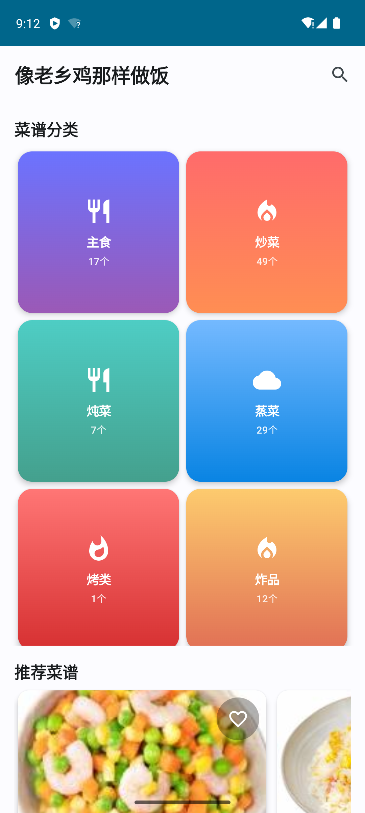

# 像老乡鸡那样做饭 - Android菜谱应用

一个基于Android平台的现代化菜谱应用，提供丰富的中式菜谱内容和优雅的用户界面。

## 📱 应用截图

### 首页界面
<div align="center">
  
  <p><em>应用首页 - 展示菜谱分类和推荐内容</em></p>
</div>

### 主要功能展示
- 🏠 **首页**：2×7网格布局展示14个菜谱分类
- 📋 **菜谱配料**：独立的配料清单展示区域  
- 🔍 **智能搜索**：支持菜谱名称、配料、步骤搜索
- ❤️ **收藏功能**：个人收藏管理
- ⭐ **评分系统**：用户评分和评论

## ✨ 功能特性

### 🍳 菜谱浏览
- **分类浏览**：支持主食、炒菜、炖菜、蒸菜、烤类、炸品、凉拌、卤菜、早餐、汤、烫菜、砂锅菜、煮锅、饮品等14个分类
- **2×7网格布局**：首页采用美观的网格布局展示菜谱分类
- **菜谱配料**：独立的配料清单展示区域

### 🔍 智能搜索
- **全文搜索**：支持按菜谱名称、配料、制作步骤搜索
- **实时搜索**：输入即时显示搜索结果
- **搜索历史**：保存用户搜索记录

### 📖 菜谱详情
- **详细信息**：包含菜谱分类、配料数量、制作步骤等基本信息
- **配料清单**：完整的配料列表展示
- **制作步骤**：详细的图文制作指导
- **高清图片**：每个菜谱配有精美的成品图片

### ❤️ 个人收藏
- **收藏功能**：一键收藏喜欢的菜谱
- **收藏管理**：专门的收藏页面管理个人菜谱
- **快速访问**：快速找到收藏的菜谱

### ⭐ 评分系统
- **菜谱评分**：用户可以对菜谱进行评分
- **评论功能**：支持添加制作心得和评论
- **评分统计**：显示菜谱的平均评分

### 🎨 现代化UI设计
- **Material Design 3**：采用最新的Material Design设计规范
- **深色模式支持**：自适应系统主题
- **流畅动画**：丰富的页面转场和交互动画
- **响应式布局**：适配不同屏幕尺寸

## 🛠️ 技术栈

### 核心框架
- **Kotlin** - 主要开发语言
- **Jetpack Compose** - 现代化UI框架
- **Android Architecture Components** - MVVM架构

### 数据存储
- **Room Database** - 本地数据库
- **Flow** - 响应式数据流
- **Coroutines** - 异步编程

### 依赖注入
- **Hilt** - 依赖注入框架

### 图片加载
- **Coil** - 异步图片加载库

### 数据解析
- **Gson** - JSON数据解析

### 构建工具
- **Gradle** - 项目构建
- **Android Gradle Plugin** - Android构建支持

## 📦 项目结构

```
android_app/
├── app/
│   ├── src/main/
│   │   ├── java/com/cooklikehoc/recipes/
│   │   │   ├── data/
│   │   │   │   ├── database/          # 数据库相关
│   │   │   │   ├── model/             # 数据模型
│   │   │   │   └── repository/        # 数据仓库
│   │   │   ├── di/                    # 依赖注入
│   │   │   ├── ui/
│   │   │   │   ├── components/        # UI组件
│   │   │   │   ├── screens/           # 页面
│   │   │   │   ├── theme/             # 主题
│   │   │   │   └── viewmodel/         # ViewModel
│   │   │   ├── utils/                 # 工具类
│   │   │   └── MainActivity.kt        # 主Activity
│   │   ├── assets/                    # 静态资源
│   │   │   ├── categories/            # 分类数据
│   │   │   ├── images/                # 菜谱图片
│   │   │   └── metadata.json          # 元数据
│   │   └── res/                       # Android资源
│   └── build.gradle                   # 应用构建配置
├── gradle/                            # Gradle配置
└── build.gradle                       # 项目构建配置
```

## 🚀 安装与运行

### 环境要求
- Android Studio Arctic Fox 或更高版本
- Android SDK 24 (Android 7.0) 或更高版本
- Kotlin 1.8.0 或更高版本

### 安装步骤

1. **克隆项目**
   ```bash
   git clone [项目地址]
   cd cooklikehoc-android
   ```

2. **打开项目**
   - 使用Android Studio打开项目
   - 等待Gradle同步完成

3. **运行应用**
   - 连接Android设备或启动模拟器
   - 点击"Run"按钮或使用快捷键 `Shift + F10`

### 构建APK

```bash
# 进入android_app目录
cd android_app

# 构建Debug版本
./gradlew assembleDebug

# 构建Release版本
./gradlew assembleRelease
```

生成的APK文件位于：`app/build/outputs/apk/`

## 📊 数据来源

应用中的菜谱数据来源于开源项目，包含：
- **14个菜谱分类**
- **数百道精选菜谱**
- **详细的配料清单**
- **图文并茂的制作步骤**
- **高质量的菜谱图片**

所有数据都经过精心整理和验证，确保内容的准确性和实用性。

## 🔧 开发说明

### 数据库设计
- **Recipe表**：存储菜谱基本信息
- **Category表**：存储分类信息
- **Favorite表**：存储用户收藏
- **Rating表**：存储用户评分

### 架构模式
采用MVVM架构模式：
- **Model**：数据模型和业务逻辑
- **View**：Jetpack Compose UI
- **ViewModel**：UI状态管理

### 数据流
```
UI Layer (Compose) ↔ ViewModel ↔ Repository ↔ Database (Room)
```

## 🤝 贡献指南

欢迎提交Issue和Pull Request来改进这个项目！

### 提交规范
- 使用清晰的提交信息
- 遵循现有的代码风格
- 添加必要的测试

### 开发流程
1. Fork项目
2. 创建功能分支
3. 提交更改
4. 创建Pull Request

## 📄 许可证

本项目采用 [MIT许可证](LICENSE)

## 🙏 致谢

特别感谢以下项目和平台：

- **[CookLikeHOC](https://github.com/Gar-b-age/CookLikeHOC)** - 提供了丰富的菜谱数据来源，为本项目的内容基础做出了重要贡献
- **[CodeBuddy](https://www.codebuddy.com/)** - 提供了优秀的AI编程助手服务，大大提高了开发效率和代码质量

同时感谢所有为开源社区贡献力量的开发者们！

---

## 📞 联系方式

如有问题或建议，请通过以下方式联系：

- 提交 [Issue](../../issues)
- 发送邮件至：[linwinfan@gmail.com]

---

**让我们一起像老乡鸡那样做饭！** 🍳✨